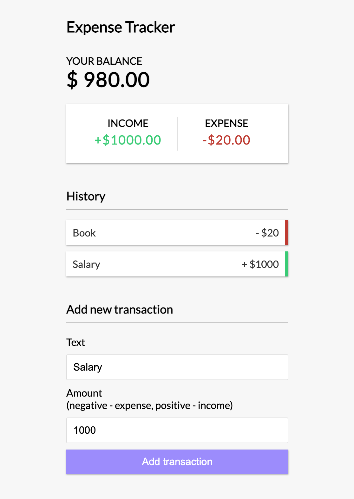

# Expense Tracker APP
Expense tracker app example from Traversy Media masterclass using REACT with  and .

## Stack
- REACT
- [Typescript](https://www.typescriptlang.org)
- [VITE](https://vitejs.dev)
- [ESLint](https://eslint.org)

## Concepts
- Componentization
- Hooks (context and reducer)

## Screenview

